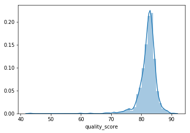

# What Defines Good Coffee?

## Project Overview

Typically coffee is described in qualitative terms such as "tasty" or "disgusting." However, I was interested to see if there was a more quantified measure in which we can evaluate coffee quality.

The coffee quality database created by James LeDoux by webscraping The Coffee Quality Institute in January 2018, consisting of 1312 data points, was used in this project. All 1312 data points were arabica coffee samples submitted by producers around the world. After cleaning, 1179 data points remained for analysis. Temperature data was also obtained from the World Bank and merged into the dataset. Information on the standards of coffee grading and quality from the Specialty Coffee Association and the Coffee Quality Institute Q Grading System was also used in the analysis of the results.

<b><u> Key Questions For This Project</u></b>:
* Can we quantitatively evaluate coffee quality? If yes, how can it be measured?
* What factors contribute to the evaluation of coffee quality?
* What are the factors that weigh the most in the evaluation?
* Finally, is it possible to predict coffee quality?

## Key Variables

<b><u>Target Variable</u>:</b> Quality Score
* This variable is a numerical representation of coffee quality.
* If the quality score is on the higher end, this means the quality of the coffee is great.
* If the quality score is on the lower end, this means the quality of the coffee is not as great.

<b><u>Feature Variables</u>:</b> Grading criteria used by the Coffee Quality Institute 
* Each criterion contributes to the quality score but how does each of them weigh in the final score.
* Understanding the relationships between the criterion and how it contributes to the final score can help coffee producers focus on specific features that will help them produce higher quality coffee beans

## Coffee Standards

In order to interpret the results from the analysis, I wanted to first understand the established standards used to define coffee quality. The estabished standards for grading coffee as defined by the Specialty Coffee Association are:

* 350g sample of green coffee are used for testing
* 3 certified Q graders contributed to the final score given to each sample
* Graded on different parameters such as: Aroma, Flavor, Aftertaste, Acidity, Balance, Number of Defects
* Cupping Evaluation
* Amount of Category 1 Defects
    * To qualify as specialty grade coffee, there should be 0 Category 1 defects.
* Amount of Category 2 Defects
    * To qualify as specialty grade coffee, there should be 5 or less Category 2 defects

More information can be found on the Speciality Coffee Association's <a href=https://sca.coffee/research/coffee-standards>website</a>.

## Data Collection and Analysis

Data from the Coffee Quality Database was first cleaned by removing columns with all null values such as: ICO Number, and Cupping Procedure and Descriptors. Afterwards, columns with null values were reviewed. Null values in the "Country of Origin" column were filled with "Columbia" because the Owner listed for the samples with the null values are in Columbia.

Afterwards, the formats of the data values in some of the columns were altered for better processing. The moisture column values were stripped of the '%' sign, converted to a float, and scaled. Similarly, the formats of the data values in the Category One Defects and Category Two Defects columns were stripped of the words and converted to integers. Country names were renamed for better testing in model creation. Column names were also renamed to move the whitespaces between the words for better processing in model testing.

Outliers were identified by looking at the distribution of quality scores and the descriptive statistics of the quality scores. There is a gap between the lower and higher scores which contribute to the skewness of the distribution. Data points with a quality score of 0 were removed. Despite this, there remains some skewness as there is a gap between the lower and higher scores. Because there are a significiant number of scores on each end, I did not remove any of these points.

  

Temperature data gathered from the World Bank was merged into dataframe using Country as the key. In later steps, it was removed as a feature variable as it was considered not significant in the model according to the p values in the OLS regression analysis. 

## Linear Regression Model Preparation and Testing

The variables used in the linear regression model testing were: quality score (as target variable), country of origin, temperature, aroma, flavor, acidity, aftertaste, body, balance, uniformity, sweetness, clean cup, cupper points, and processing method. These variables were chosen for the testing because of the completion and cleanliness of the data available as well as their relationships to the target variables.

Because the quality score is on the scale out of 100 but the numerical feature variables are out of 10, the feature variables were scaled to match that of the quality score by multiplying each value by 10.

Before testing, the correlation between pairs of variables was analyzed using a correlation table, heatmap, and correlation scatter matrix. Some of the observations from these show the following relationships:

* Quality Score and Flavor: 0.8
* Aroma and Flavor: 0.75
* Flavor and Aftertaste: 0.85
* Aftertaste and Cupper Points: 0.74

In the heatmap below, the black color range indicate positive correlation and the red color range indicate negative correlation. The darker the color, the higher the correlation in the pair. The lighter the color, the lower the correlation in the pair.

  

The scatter matrix below show another way to view the relationship between pairs of variables. There seem to be linear relationships between quality score and cupper points, quality score and flavor, quality score and aroma, aroma and cupper points, aroma and aftertaste, and flavor and aftertaste.

  

The observations from these diagrams were used to create interaction variables for testing. Interaction variables created were: aroma x flavor, aroma x cupper points, flavor x cupper points, and flavor x aftertaste. 

Dummy variables were created for the categorical varables: Category One Defects, Category Two Defects, Country of Origin, and Temperature.
